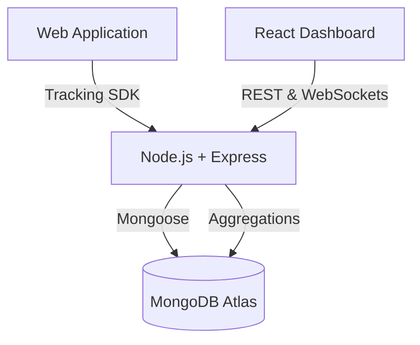

# InsightFlow V3.0
**A professional, self-hosted analytics platform inspired by Mixpanel and PostHog.**

InsightFlow is a full-stack product analytics solution that allows you to track user journeys, visualize conversion funnels, and generate real-time heatmaps without compromising your user's privacy to third-party providers.

---

## 🚀 Key Features

- **Real-Time Event Tracking:** Standalone Vanilla JS SDK tracks page views and clicks seamlessly.
- **Conversion Funnels:** Server-side MongoDB aggregations accurately map user drop-offs.
- **Advanced Heatmaps:** Canvas-based rendering (`mix-blend-mode: multiply`) layers click density onto a simulated viewport.
- **Session Journeys:** Deep dive into individual user paths, featuring contiguous event clustering (e.g., rapid click detection).
- **Offline Resilience:** The tracking SDK queues events in `localStorage` when offline and automatically retries upon reconnection.
- **Premium SaaS UI:** Designed with cues from Vercel, Linear, and Stripe, featuring sleek typography, custom charts, and heavy use of `framer-motion`.

## 🏗️ Architecture



## 🛠️ Tech Stack

**Frontend (Dashboard):**
- React 19 + Vite
- TypeScript
- Tailwind CSS v4
- Recharts
- Framer Motion
- React Router DOM v7
- React Query (TanStack)
- Lucide Icons

**Backend (API & Storage):**
- Node.js
- Express
- TypeScript
- MongoDB (Mongoose)
- Socket.io
- CORS & Helmet

## 📂 Folder Structure

```
c:/hackathon/full stack developer role/
├── frontend/
│   ├── src/
│   │   ├── components/       # Reusable UI elements (Cards, Buttons)
│   │   ├── pages/            # Dashboard, Funnels, Heatmap, Sessions
│   │   ├── services/         # API fetching logic
│   │   └── App.tsx           # Routing configuration
│   ├── index.css             # Tailwind imports
│   └── package.json
└── backend/
    ├── src/
    │   ├── controllers/      # Analytics logic and aggregations
    │   ├── models/           # Mongoose schemas (Event)
    │   ├── routes/           # API endpoints
    │   └── index.ts          # Server entrypoint
    ├── scripts/              # Database seeding logic
    └── package.json
```

## ⚙️ Setup & Installation

### 1. Environment Variables
Create a `.env` file in the `backend` directory:
```env
PORT=5000
MONGO_URI=mongodb+srv://<username>:<password>@cluster.mongodb.net/insightflow?retryWrites=true&w=majority
FRONTEND_URL=http://localhost:5174
```

### 2. Install Dependencies
```bash
# In the backend directory
npm install

# In the frontend directory
npm install
```

### 3. Seed Database (Optional)
Generate realistic session data:
```bash
cd backend
npm run seed
```

### 4. Run Locally
```bash
# Terminal 1: Start Backend
cd backend
npm run dev

# Terminal 2: Start Frontend
cd frontend
npm run dev
```
The dashboard will be available at `http://localhost:5174`.

## 🔌 API Documentation

### `POST /api/events`
Tracks a new event.
- **Payload:** `{ sessionId: string, eventType: "page_view" | "click", pageUrl: string, timestamp: Date, coordinates?: { x, y }, metadata?: { browser, os } }`

### `GET /api/analytics/overview`
Returns high-level KPIs and time-series data for the dashboard.

### `GET /api/analytics/funnels`
Executes an aggregation pipeline to return conversion percentages across the `/home -> /products -> /cart -> /checkout` flow.

### `GET /api/analytics/heatmap?url=/home`
Returns all coordinates for click events on a specific page.

### `GET /api/sessions`
Returns paginated, aggregated user sessions sorted by last seen date, duration, or event count.

---

## 🧠 Engineering Decisions
1. **Aggregations over Client Filtering:** To ensure the Node.js event loop isn't blocked and massive payloads aren't sent over the wire, complex operations like Funnel Analysis are handled natively by MongoDB using `$match` and `$group`.
2. **Canvas Heatmaps:** Instead of rendering thousands of DOM nodes for heatmap clicks, the `HeatmapView` uses the HTML5 `<canvas>` API with a radial gradient and `multiply` blend mode. This keeps the React tree extremely lightweight.
3. **Event Clustering:** The UI clusters contiguous identical events (e.g., rage clicks) to prevent timeline bloat, vastly improving the UX for analysts reviewing sessions.

## 🔮 Future Improvements
- Implement click replay utilizing DOM mutation observers.
- Support custom funnel definitions directly from the UI.
- Add user authentication and role-based access control (RBAC).
